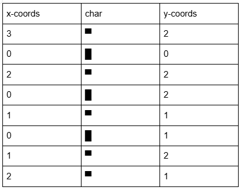
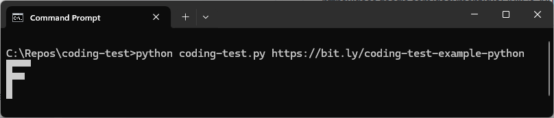

# Coding Test Example (Python)

<b>Table of Contents</b>

1. [Introduction](#introduction)
2. [Installation Instructions](#installation-instructions)
3. [Usage](#usage)
4. [Disclaimer](#disclaimer)

 

## Introduction
This is a simple <ins>**console/terminal**</ins> Python script that downloads a Google Doc from a specified URL and if the Google Doc is in the correct format, a grid of uppercase characters will be printed to the console.
  
**Example Google Doc format:** 

 
**Note:** This can also be found <a href="https://bit.ly/coding-test-example-python" target="_blank" >here</a>.
  
**Sample output:** 

  

## Installation Instructions
1. git clone https://github.com/kalcorn/coding-test-example-python.git
2. cd coding-test-example-python
3. pip install -r requirements.txt
  

## Usage
python coding-test.py [GOOGLE DOCS URL GOES HERE]
  
**Examples:**
 
- Simple: 
python coding-test.py https://bit.ly/coding-test-example-python
  
- Complex: 
python coding-test.py https://bit.ly/coding-test-example-python-complex
  

## Disclaimer
This software is provided “as is”, without warranty of any kind, express or implied, including but not limited to the warranties of merchantability, fitness for a particular purpose and noninfringement. In no event shall the authors or copyright holders be liable for any claim, damages or other liability, whether in an action of contract, tort or otherwise, arising from, out of or in connection with the software or the use or other dealings in the software.