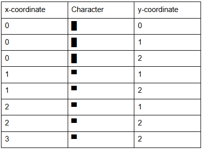
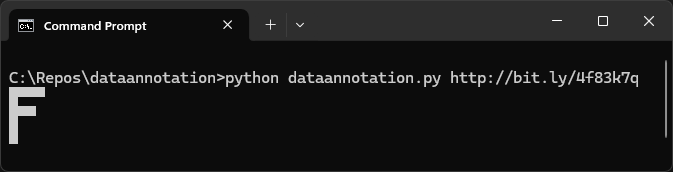

# DataAnnotation Coding Test Example (Python)
This is a simple Python script that downloads a Google Doc from a specified URL and if it's in the correct format, a grid of uppercase characters will be printed to the console.
  
Example Google Doc format: 

  
Sample output: 

  

## Usage
Simple example: 
python dataannotation.py https://docs.google.com/document/d/e/2PACX-1vRMx5YQlZNa3ra8dYYxmv-QIQ3YJe8tbI3kqcuC7lQiZm-CSEznKfN_HYNSpoXcZIV3Y_O3YoUB1ecq/pub
  
Complex example: 
python dataannotation.py https://docs.google.com/document/d/e/2PACX-1vTER-wL5E8YC9pxDx43gk8eIds59GtUUk4nJo_ZWagbnrH0NFvMXIw6VWFLpf5tWTZIT9P9oLIoFJ6A/pub