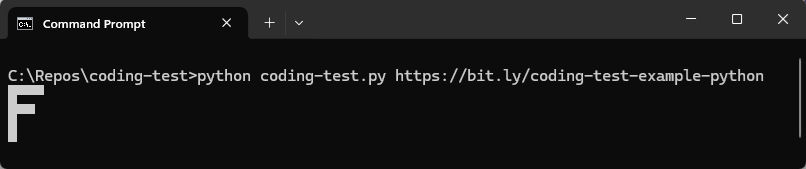

# Coding Test Example (Python)
This is a simple Python script that downloads a Google Doc from a specified URL and if it's in the correct format, a grid of uppercase characters will be printed to the console.
  
**Example Google Doc format:** 

 
**Note:** This can also be found <a href="https://bit.ly/coding-test-example-python" target="_blank" >here</a>.
  
**Sample output:** 

  

## Usage
python coding-test.py [GOOGLE DOCS URL GOES HERE]
  
**Examples:**
  
Simple: 
python coding-test.py https://bit.ly/coding-test-example-python
  
Complex: 
python coding-test.py https://bit.ly/coding-test-example-python-complex
  

## Disclaimer
This software is provided “as is”, without warranty of any kind, express or implied, including but not limited to the warranties of merchantability, fitness for a particular purpose and noninfringement. In no event shall the authors or copyright holders be liable for any claim, damages or other liability, whether in an action of contract, tort or otherwise, arising from, out of or in connection with the software or the use or other dealings in the software.